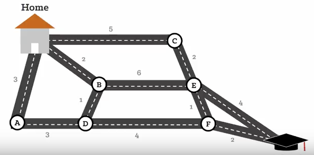

##### Shortest Path Algorithm
###### by John Melody Me 
---

[](https://ci.appveyor.com/project/johnmelodyme/shortestpathalgorithm)

One algorithm for finding the shortest path from a starting node to a target node in a weighted graph is Dijkstra’s algorithm. The algorithm creates a tree of shortest paths from the starting vertex, the source, to all other points in the graph.

 

Suppose a student wants to go from home to school in the shortest possible way. She knows some roads are heavily congested and difficult to use. In Dijkstra's algorithm, this means the edge has a large weight--the shortest path tree found by the algorithm will try to avoid edges with larger weights. If the student looks up directions using a map service, it is likely they may use Dijkstra's algorithm, as well as others.




```pseudocode
Home→B→D→F→School.
```

<b>Formulae</b>
```latex
\usepackage{amsmath}
\begin{equation}
Graph = {(Vetex, Edges)}
\end{equation}
```
