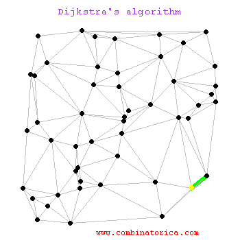

# Shortest Path Algorithm (最短路徑算法)
###### by John Melody Me 
---
[![alt text][1.1]][1]
[![alt text][2.1]][2]
[![alt text][3.1]][3]

[1.1]: http://i.imgur.com/tXSoThF.png (twitter icon with padding)
[2.1]: http://i.imgur.com/P3YfQoD.png (facebook icon with padding)
[3.1]: http://i.imgur.com/0o48UoR.png (github icon with padding)

[1]: http://www.twitter.com/johnmelodyme
[2]: http://www.facebook.com/johnmelodyme
[3]: http://www.github.com/johnmelodyme

[](https://ci.appveyor.com/project/johnmelodyme/shortestpathalgorithm)
[](https://travis-ci.org/johnmelodyme/ShortestPathAlgorithm)

One algorithm for finding the shortest path from a starting node to a target node in a weighted graph is Dijkstra’s algorithm. The algorithm creates a tree of shortest paths from the starting vertex, the source, to all other points in the graph.

Dijkstra的算法是一種用於找到加權圖中從起始節點到目標節點的最短路徑的算法。 該算法創建了從起始頂點（源）到圖中所有其他點的最短路徑樹。

 

Suppose a student wants to go from home to school in the shortest possible way. She knows some roads are heavily congested and difficult to use. In Dijkstra's algorithm, this means the edge has a large weight--the shortest path tree found by the algorithm will try to avoid edges with larger weights. If the student looks up directions using a map service, it is likely they may use Dijkstra's algorithm, as well as others.

假設一個學生想以最短的方式從家到學校。 她知道有些道路非常擁擠且難以使用。 在Dijkstra的算法中，這意味著邊緣具有較大的權重-算法找到的最短路徑樹將嘗試避免權重較大的邊緣。 如果學生使用地圖服務查找路線，則他們可能會使用Dijkstra的算法以及其他算法。


```pseudocode
Home→B→D→F→School.
```

<b>Formulae</b>
```latex
\usepackage{amsmath}
\begin{equation}
Graph = {(Vetex, Edges)}
\end{equation}
```

<br />

## Support My Project
<br />

### Wechat Pay:


<br />

### Bitcoin:

